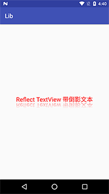

# ReflectTextView

带倒影效果的TextView

#### 演示:



#### 使用：

##### Project build.gradle配置

```groovy
allprojects {
  repositories {
    ...
    maven { url 'https://jitpack.io' }
  }
}
```

##### Module build.gradel配置

```groovy
dependencies {
        compile 'com.github.Dean1990:ReflectTextView:-SNAPSHOT'
}
```

##### 布局

```xml
<com.deanlib.reflecttextview.ReflectTextView
        android:layout_width="wrap_content"
        android:lineSpacingMultiplier="1.3"
        android:layout_height="wrap_content"
        reflect:spacingValue="5dp"
        reflect:reflectAlpha="120"
        reflect:reflectHeightMultiple="0.8"
        android:text="Reflect TextView 带倒影文本"
        android:textColor="#FF0000"
        android:textSize="20sp"
       />
```

##### 布局文件可设置参数说明：

| 参数名                           | 说明           | 默认值              |
| ----------------------------- | ------------ | ---------------- |
| reflect:spacingValue          | 实体文字与倒影之间的空隙 | 0dp              |
| reflect:reflectAlpha          | 倒影透明度        | 100，取值范围 [1-255] |
| reflect:reflectHeightMultiple | 倒影的高度倍数      | 1f，取值范围 [0-1f]   |

#### Demo:

[https://github.com/Dean1990/LibDemo](https://github.com/Dean1990/LibDemo)
